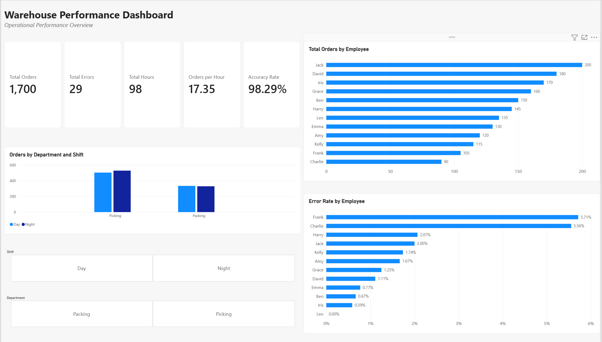
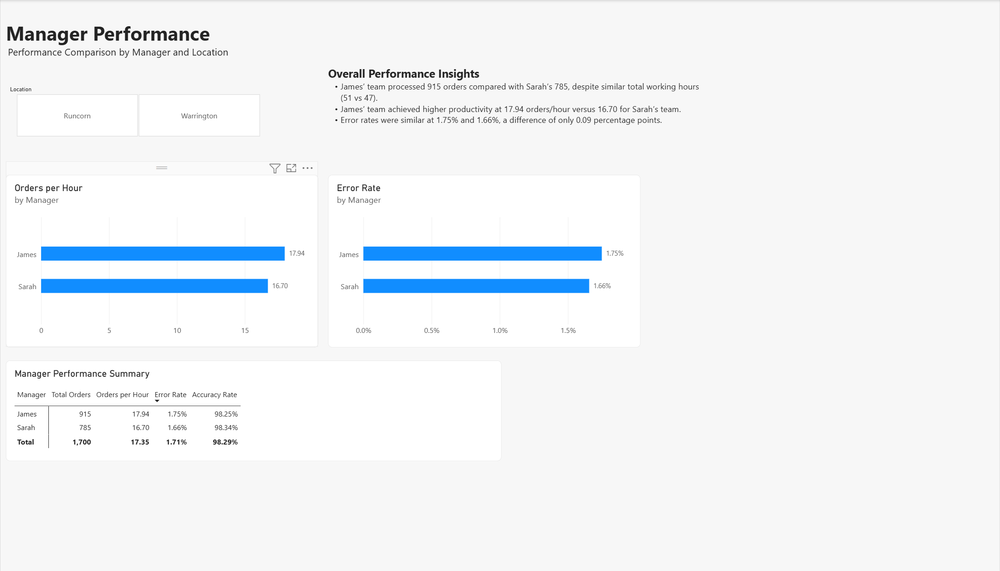

# Warehouse Performance Dashboard

## Project Overview

This project analyses warehouse operational performance using SQL and Power BI.

The aim of the project is to evaluate order volume, productivity, error rates and employee performance across departments, shifts, managers and locations.

The dashboard provides an interactive view of key operational KPIs and helps identify differences in productivity and quality performance.

## Tools Used

- Excel
- PostgreSQL
- SQL
- Power BI
- Power Query
- DAX

## Dashboard Preview

### Overview



### Manager Performance



## Business Questions

1. How many orders were processed and how efficiently were they completed?
2. How does performance differ between departments and shifts?
3. Which employees have the highest order volume and error rates?
4. How does productivity and quality differ between manager teams?
5. How does operational performance vary by location?

## Data Preparation & Analysis

### Data Cleaning with Power Query

The dataset was prepared in Power Query before building the dashboard.

Key steps included:

- Checked and corrected data types for each column.
- Reviewed column quality and distribution to identify missing or invalid values.
- Applied Trim and Clean transformations to text fields.
- Checked employee records for duplicates.
- Created an Employee ID to support data modelling.

### Data Modelling

A simple star-schema approach was used to separate employee information from operational data.

- **WarehouseData** - Fact table containing Orders, Errors, Hours, Department and Shift.
- **EmployeeInfo** - Dimension table containing Employee ID, Employee, Manager and Location.
- Created a **one-to-many (1:*) relationship** using Employee ID.
- Used single-direction filtering from EmployeeInfo to WarehouseData.

### DAX Measures

The following measures were created to calculate operational KPIs:

```DAX
Total Orders = SUM(WarehouseData_1__2[Orders])

Total Errors = SUM(WarehouseData_1__2[Errors])

Total Hours = SUM(WarehouseData_1__2[Hours])

Orders per Hour =
DIVIDE([Total Orders], [Total Hours])

Error Rate =
DIVIDE([Total Errors], [Total Orders])

Accuracy Rate =
DIVIDE([Total Orders] - [Total Errors], [Total Orders])
```

## Key KPIs

- Total Orders
- Total Errors
- Total Hours
- Orders per Hour
- Error Rate
- Accuracy Rate
